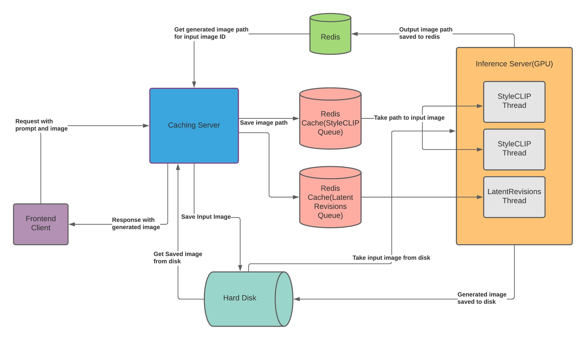

# mead-backend

### Instructions for Installation
1. Clone this repository.
2. `cd mead-backend`
3. Install all the dependencies and download all the required weights: `sudo sh setup.sh`
4. Start the redis in-memory database using: `redis-server`

### Files
* [`app.py`](app.py): This file has the basic API's for testing. Its not a threaded application and will only process one request at a time.
* [`inference_server.py`](inference_server.py): This file runs threads for inferencing from images from the redis queue. This runs multiple threads for both StyleCLIP and LatentRevisions. The number of threads can be defined in the [`caching_config.py`](caching_config.py). Max possible thhreads without causing CUDA OOM errors on a single Tesla T4 are already defined in the file.
* [`caching_server.py`](caching_server.py): Run this server after running [`inference_server.py`](inference_server.py). This is also a Flask app with endpoints for both the models. This is a threaded application and pushes all the incoming images in the Redis queue.

### Performance
A single process takes up 90%+ processing power of the GPU, so it is recommended to run only one process at a time. Running multiple threads at the same time results in delay for individual threads, because the GPU usage is too much. Still multiple threads are possible because of extra GPU memory available.
* LatentRevision: Processing takes 45-50 seconds for a 100 iterations for a single call(single threaded). Multithreaded would be slower for individual threads, but still faster that processing 'n' images in a single thread.
* StyleCLIP: The model is run for 50 iterations, which takes 8-10 seconds to finish per call. First inference is always 20+ seconds.

### TODOS 
* Add input weights, extra text prompts, and started images for LatentRevisions